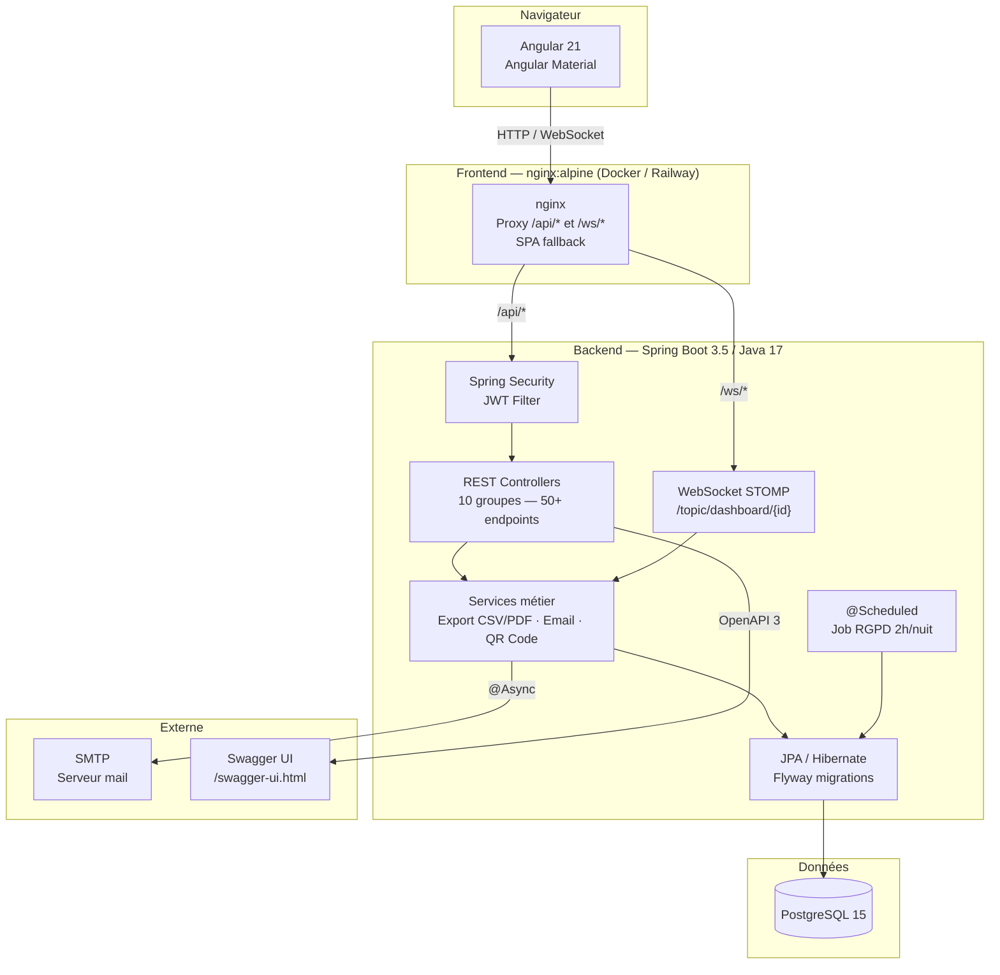

# FestManager

> Application web de gestion de bénévoles et de logistique pour festivals et événements culturels.


---

## Présentation

FestManager est né d'un besoin terrain : gérer efficacement des dizaines de bénévoles sur un festival avec des missions variées, des créneaux horaires, des organisations prestataires et des accréditations — le tout en temps réel.

L'application remplace les tableurs, emails et WhatsApp par une plateforme centralisée, conforme au RGPD, déployable via Docker en quelques minutes.

---

## Aperçu

| Dashboard temps réel | Gestion des bénévoles |
|---|---|
|  |  |

| Accréditation QR Code | Documentation Swagger |
|---|---|
|  |  |

> Les screenshots seront ajoutés après stabilisation du déploiement Coolify.

---

## Fonctionnalités

| Fonctionnalité | Statut |
|---|---|
| Authentification JWT (login + inscription) | ✅ |
| Récupération de mot de passe (token email, durée 1h) | ✅ |
| Gestion des événements (CRUD + bannière) | ✅ |
| Gestion des missions et créneaux horaires (CRUD) | ✅ |
| Inscription bénévoles (3 flux : libre, manuelle, invitation email) | ✅ |
| Affectation bénévoles avec contrôle des conflits horaires | ✅ |
| Tableau de bord temps réel (WebSocket STOMP) | ✅ |
| Gestion des organisations prestataires + espace référent | ✅ |
| Journal d'audit RGPD | ✅ |
| Accréditations avec génération de QR code | ✅ |
| Badges PDF (A6 paysage, photo, QR code, zones d'accès) + export ZIP | ✅ |
| Export planning CSV et PDF | ✅ |
| Notifications email (confirmation affectation, invitation, rappel) | ✅ |
| Anonymisation automatique RGPD (job nocturne, Art. 17) | ✅ |
| Page Mentions Légales | ✅ |
| Documentation API Swagger / OpenAPI 3 | ✅ |
| Déploiement démo en ligne (Railway) | ✅ |
| Portail d'inscription public (`/inscription`, sans authentification) | ✅ |
| Validation admin des nouveaux comptes (actif=false → validation manuelle) | ✅ |
| Stockage de fichiers (photos bénévoles, bannières événements) | ✅ |
| Connexion Google OAuth (staff) | ✅ |
| Profil bénévole auto-éditable via magic link (taille t-shirt, photo) | ✅ |

---

## Architecture



### Structure du dépôt

```
FestManager/
├── backend/           # API REST Spring Boot
│   ├── src/main/java/com/festmanager/
│   │   ├── config/        # Security, JWT, WebSocket, OpenAPI
│   │   ├── controller/    # 10 controllers REST
│   │   ├── service/       # Métier, Export, Email, QR, RGPD
│   │   ├── entity/        # Entités JPA
│   │   ├── repository/    # Spring Data JPA
│   │   └── dto/           # Request / Response
│   └── src/test/          # 95 tests Mockito
├── frontend/          # Application Angular 21
│   ├── src/app/features/  # Modules fonctionnels
│   └── src/app/shared/    # Layout, guards, services
├── docs/              # Documentation technique + roadmap
└── docker-compose.yml
```

---

## Stack technique

| Couche | Technologie |
|---|---|
| Backend | Spring Boot 3.5 / Java 17 |
| Frontend | Angular 21 + Angular Material |
| Base de données | PostgreSQL 15 |
| Temps réel | WebSocket (STOMP over SockJS) |
| Auth | Spring Security + JWT (jjwt 0.12.6) |
| QR Code | ZXing 3.5.3 |
| Export PDF | OpenPDF 2.0.3 |
| Export CSV | Apache Commons CSV 1.11 |
| Email | Spring Boot Mail (SMTP, async) |
| Documentation API | springdoc-openapi 2.8.3 (OpenAPI 3) |
| Containerisation | Docker + Docker Compose |
| Déploiement | Hetzner VPS CX22 + Coolify (staging + production) |
| CI/CD | GitHub Actions (CI + deploy via webhooks Coolify) |

---

## Lancement

### Avec Docker *(recommandé)*

```bash
git clone https://github.com/naviss29/FestManager.git
cd FestManager
docker compose build
docker compose up
```

| Service | URL |
|---|---|
| Application | http://localhost:4200 |
| API backend | http://localhost:8080 |
| Swagger UI | http://localhost:8080/swagger-ui.html |

> Docker Desktop doit être démarré. Seuls Docker et Git sont nécessaires.

### En développement local hybride *(recommandé pour coder)*

PostgreSQL tourne dans Docker, backend et frontend en natif avec hot-reload.

**Prérequis :** Docker Desktop, Java 17 ([Eclipse Temurin](https://adoptium.net)), Node.js 20+

```bash
# Terminal 1 — Base de données uniquement
docker compose up postgres -d

# Terminal 2 — Backend Spring Boot (hot-reload)
cd backend
./mvnw spring-boot:run -Dspring-boot.run.profiles=local

# Terminal 3 — Frontend Angular (hot-reload)
cd frontend
npm install && npm start
```

| Service | URL |
|---|---|
| Application | http://localhost:4200 |
| API backend | http://localhost:8080 |
| Swagger UI | http://localhost:8080/swagger-ui.html |

### En développement local *(sans Docker, base H2)*

Le profil `dev` utilise une base H2 embarquée — aucune installation de PostgreSQL requise.

```bash
# Backend
cd backend
./mvnw spring-boot:run -Dspring-boot.run.profiles=dev

# Frontend (dans un autre terminal)
cd frontend
npm install && npm start
```

> La base H2 est recréée à chaque redémarrage du backend. Utile pour tester rapidement sans Docker.

---

## Tests

```bash
# Backend — tests Mockito (sans Spring context, sans base de données)
cd backend
./mvnw test

# Frontend — tests Vitest
cd frontend
npm test -- --watch=false
```

**Backend (111 tests)** : Auth, Bénévoles, Événements, Missions, Organisations, Créneaux, Affectations, Journal d'audit, Audit, Export CSV/PDF, RGPD, Badges PDF, Google OAuth, Profil bénévole  
**Frontend (91 tests)** : tous les services HTTP (MissionService, EvenementService, BenevoleService, AccreditationService, PlanningService, OrganisationService, DashboardRestService, AuthService, WebSocketService, FichierService)

---

## Documentation

- [Documentation complète](./docs/FestManager_Documentation.md) — contexte, modèle de données, RGPD, roadmap, guide Railway
- [Pense-bête / idées futures](./docs/pense-bete.md)
- [Swagger UI](http://localhost:8080/swagger-ui.html) *(en local)* — 50+ endpoints documentés

---

## Roadmap

- [x] Phase 0 — Cadrage, modèle de données, documentation
- [x] Phase 1 — Fondations (Spring Boot, Angular, Docker, JWT, entités JPA)
- [x] Phase 2 — Core features (CRUD complet, affectations, WebSocket, auth)
- [x] Phase 3 — Features avancées (QR codes, dashboard temps réel, exports CSV/PDF, RGPD, email, mentions légales)
- [x] Phase 4 — Finalisation (Swagger ✅, déploiement Railway ✅, diagramme architecture ✅, README screenshots ✅)
- [x] Phase 5 — Gestion des comptes (portail inscription public ✅, validation admin ✅, stockage fichiers ✅, mot de passe oublié ✅, créneaux horaires ✅)
- [x] Phase 5b — Auth avancée (Google OAuth ✅, magic link profil bénévole ✅)
- [ ] Phase 6 — Pipeline de recette (branche `develop` ✅, deploy staging auto ✅, approbation manuelle prod ✅, healthcheck Docker ✅, nginx resilient ✅, liveness probe Spring Boot ✅)

---

## Conformité RGPD

FestManager intègre la conformité RGPD dès sa conception :

- Consentement explicite recueilli et tracé à l'inscription
- Droits des personnes implémentés : accès (Art. 15), rectification (Art. 16), effacement (Art. 17), portabilité (Art. 20)
- Journal d'audit de tous les accès aux données personnelles
- Anonymisation automatique déclenchée chaque nuit (3 ans après le dernier événement)
- Aucune transmission de données à des tiers sans consentement

---

## Auteur

**Alan** — Développeur Full Stack (Java / Spring Boot / Angular)  
Projet personnel — Portfolio recruteur

[](https://linkedin.com)
[](https://github.com/naviss29)
